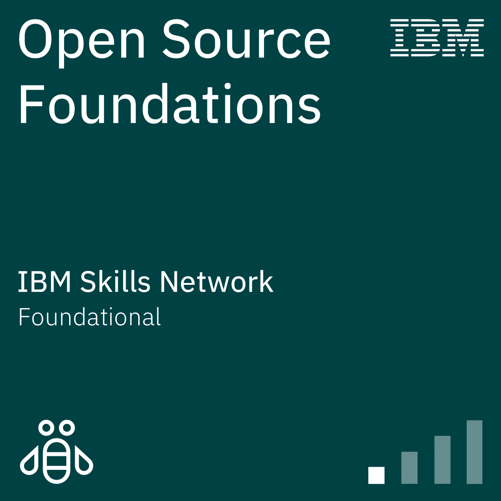

<h1 align="center">Hi 👋, I'm Viman Fernando</h1>
<h3 align="center">Passionate IT Student | Exploring the Boundless World of Cybersecurity and Web Development</h3>

<table align="center">
<tr border="none">
<td width="50%" align="left">

- 🌱 I'm currently learning **Information Systems**  
- 🧑‍🎓 I'm an Undergraduate at **UCSC**  
- 💬 Let's talk about **Crypto & Blockchain**  
- 📫 How to reach me **vimannimneth@gmail.com**

</td>
<td width="50%" align="center">
  
</td>
</tr>
</table>

---

<h3 align="center">Connect with me:</h3>
<table align="center">
  <tr>
    <td align="center">
      
    </td>
    <td align="center">
      
    </td>
    <td align="center">
      
    </td>
    <td align="center">
      
    </td>
  </tr>
</table>

---

<h3 align="center">🌐 Web Development</h3>
<table align="center">
  <tr>
    <td align="center" width="60"> HTML5</td>
    <td align="center" width="60"> CSS3</td>
    <td align="center" width="60"> JavaScript</td>
    <td align="center" width="60"> React</td>
    <td align="center" width="60"> Node.js</td>
    <td align="center" width="60"> PHP</td>
    <td align="center" width="60"> Figma</td>
  </tr>
</table>

<h3 align="center">💻 Programming Languages</h3>
<table align="center">
  <tr>
    <td align="center" width="60"> C</td>
    <td align="center" width="60"> C++</td>
    <td align="center" width="60"> Java</td>
    <td align="center" width="60"> Python</td>
  </tr>
</table>

<h3 align="center">🛠️ Tools & Databases</h3>
<table align="center">
  <tr>
    <td align="center" width="60"> Git</td>
    <td align="center" width="60"> Linux Basics</td>
    <td align="center" width="60"> MySQL</td>
  </tr>
</table>

<h3 align="center">Badges Earned</h3>
<table align="center">
  <tr>
    <td align="center" width="60"><a href="https://www.credly.com/badges/9cdda72e-63ac-4383-a23d-cf292c3af324/public_url"> Open Source Foundations</a></td>
    <td align="center" width="60"> Generative AI Overview for Project Managers</td>
  </tr>
</table>

